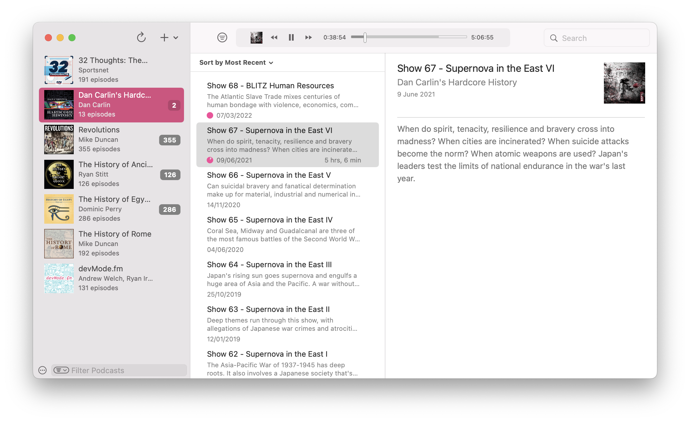

<h1 align="center">
  
  <br>
  Doughnut
  <br>
</h1>

<h4 align="center">Podcast app. For Mac.</h4>

<p align="center">
  <a href="https://github.com/serhii-londar/open-source-mac-os-apps#podcast"></a>
  
  <a href="https://github.com/dyerc/Doughnut/releases"></a>
  <a href="https://install.appcenter.ms/users/gettoset/apps/doughnut/distribution_groups/doughnut%20testers"></a>
</p>

<p align="center">
  <code>brew install --cask doughnut</code>
</p>

<p align="center">
  
</p>

**This repo is Ethan's fork of [`dyerc/Doughnut`](https://github.com/dyerc/Doughnut/) to experiment with different ideas. I'll continuously contribute to Doughnut to build it as an awesome podcast client dedicated to Macs. :partying_face:**

Doughnut is a podcast client built using Swift. The design and user experience are inspired by Instacast for Mac which was discontinued in 2015. After experimenting with alternate user interface layouts, I kept coming back to the three column layout as most useable and practical.

Beyond the standard expected podcast app features, my goals for the project are:
- [x] Support an iTunes style library that can be hosted on an internal or network shared drive 
- [x] Ability to favourite episodes
- [x] Ability to create podcasts without a feed, for miscellaneous releases of discontinued podcasts

Previously Doughnut was built on top of Electron which worked ok, but using 200+ MB for a podcast app, even when it's minimized felt very poor. Doughnut is now written as a 100% native MacOS app in Swift.

## Canary Builds

Canary builds contains latest bugfixes and features that may be under development. Builds can be download from <a href="https://install.appcenter.ms/users/gettoset/apps/doughnut/distribution_groups/doughnut%20testers">AppCenter</a>.

Canary builds has its own upgrade channel, which are signed and distributed by Ethan Wong.

## Branching Rules

* `master` should always be synced with [`dyerc/Doughnut:master`](https://github.com/dyerc/Doughnut/), which serves as a base for feature branches that are ready to be merged from the upstream repo.

* `main` (the default branch) is slightly forward than `master`, which serves as a base for feature branches that are under development.

* `ethanwong/*` are all those feature branches.

* `upstream-build` is a branch with all feature branches automated merged with scripts, for canary builds.

## How to Contribute

Pull requests should be submitted to the upstream repo.

### Local Environments

* Xcode 12.2+, latest stable release is recommended, but not required.

* Install [SwiftLint](https://github.com/realm/SwiftLint).

  ```shell
  brew install swiftlint
  ```

### Get the code

```
$ git clone git@github.com:dyerc/Doughnut.git
$ cd Doughnut
$ pod install
$ open Doughnut.xcworkspace
```
